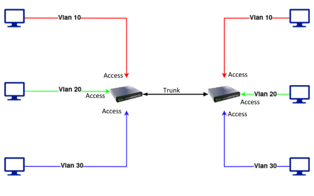

# SONIC VPP Vlan Bridging
Rev v0.1

 
 

## Table of Contents

1. [Revisions](#item-1)
2. [Scope](#item-2)
3. [Definitions/Abbreviations](#item-3)
4. [Introduction](#item-4)
5. [vlan member add call flow](#item-5)
6. [Testing](#item-6)

 
 

## Revisions

| Rev | Date | Author(s) |
|-----|------|-----------|
|v0.1 | 25/12/2023 | Bendrapu Balareddy (Cisco), Sameer Nanajkar (Cisco) |

 
 

## Scope
This document describes the high level design of integrating vlan bridging functionality between SONIC and VPP. It provides
 - 802.1ad - TODO (not supported yet)
 - 802.1q

 

## Definitions/Abbreviations
**VPP**: Vector Packet Processing (VPP) technology based high performance packet processing stack that can run on commodity CPUs. For more details see [What is VPP](https://wiki.fd.io/view/VPP/What_is_VPP%3F)

**VLAN**:  Virtual LAN

 
 

## Introduction
SONiC supports 802.1ad and 802.1q bridging support. This document's first version describes the 802.1q bridging 
 - Access port
   config vlan member add -u <portname> creates an un tagged bridge port. This will be translated to vpp in two steps
   1. creates a bridge with given vlan id as bridge id if the bridge with given id doesnot exist.
   2. set the port as member of bridge with appropriate tag rewrite
 - Trunk port
   config vlan member add  <portname> creates a tagged port bridge port. This will be translated to vpp in three steps
   1. creates a bridge with given vlan id as bridge id if the bridge with given aid does not exist.
   2. vpp trunk port operation is achieved through vlan subinterface. A subinterface is created for this vlan id. Note
      that this subinterface is only specific to vpp and does not appear in SONiC control plane data bases.
   3. set the vlan subinterface as bridge port

 

## vlan member addition callflows

## Testing
 
 
 
 
## Troubleshooting
There are some SONiC tools to debug SONiC side of functionality such as show commands, redis-dump, log files /var/log/syslog, /var/log/swss/ etc. You can connect gdb to the running processes and get useful debug information provided the image is built with INSTALL_DEBUG_TOOLS=y option.
 
For vpp data path troubleshooting a user can invoke vppctl to connec to VPP and run a CLI. Other option is to run “show platform vpp” command to see the working of vpp. “show platform” command of SONiC is extended to support vpp platform side of commands.

## References

[SONiC system architecture](https://github.com/sonic-net/SONiC/wiki/Architecture)\
[What is VPP](https://s3-docs.fd.io/vpp/23.06/)

